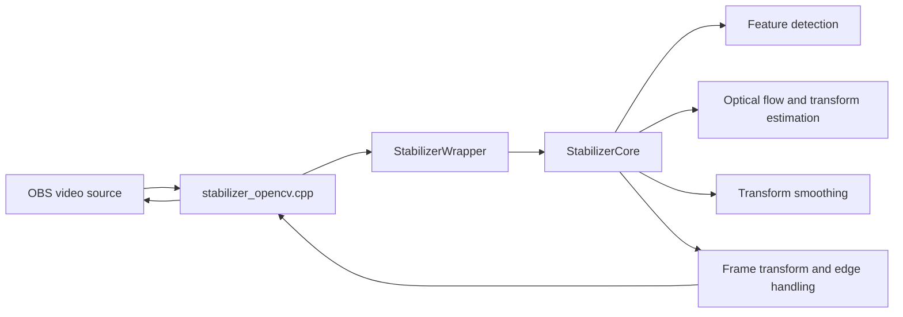

# OBS Stabilizer Developer Guide

## Architecture

The project separates OBS integration from stabilization logic.



### Main modules

- `src/stabilizer_opencv.cpp`: OBS filter lifecycle, settings, properties, and frame conversion.
- `src/core/stabilizer_wrapper.*`: synchronization and lifecycle boundary around the core.
- `src/core/stabilizer_core.*`: feature tracking, transform estimation, smoothing, metrics, and error state.
- `src/core/frame_utils.*`: OBS/OpenCV frame conversion and reusable frame helpers.
- `src/core/parameter_validation.*`: shared parameter validation and clamping.
- `src/core/preset_manager.*`: preset persistence and serialization support.
- `tests/`: unit, edge-case, performance, and concurrency tests.

## Processing flow

1. OBS passes a frame to the filter callback.
2. The integration layer validates context and converts the frame to `cv::Mat`.
3. `StabilizerWrapper` serializes mutable access where required.
4. `StabilizerCore` converts the frame to grayscale and detects or tracks features.
5. Motion is estimated from previous and current feature positions.
6. Recent transforms are smoothed.
7. The compensating transform and selected edge mode are applied.
8. Metrics and error state are updated.
9. The output is converted back to an OBS frame.

## Development setup

### Required tools

- CMake 3.16 or newer
- A C++17 compiler
- OpenCV with core, imgproc, video, calib3d, features2d, and flann components
- GoogleTest for the test target
- Ninja or another supported CMake generator
- OBS headers and libraries for plugin builds

The repository can build portions of the project in standalone mode when OBS development files are unavailable.

## Configure and build

```bash
cmake -S . -B build -G Ninja -DCMAKE_BUILD_TYPE=Debug
cmake --build build --parallel
```

For a release-oriented build:

```bash
cmake -S . -B build -G Ninja -DCMAKE_BUILD_TYPE=RelWithDebInfo
cmake --build build --parallel
```

Platform setup details are also encoded in `.github/actions/setup-build-env` and the build workflows.

### Build troubleshooting

**`CMAKE_C_COMPILER not set`**: install a toolchain — `xcode-select --install` on macOS, `sudo apt install build-essential` on Ubuntu/Linux, or the Visual Studio Build Tools on Windows.

**OBS headers**: on macOS, configure always fetches OBS's own headers (a pinned 30.0.0 source tarball) over the network via `FetchContent` and links against them; there is no standalone fallback there. To build against a local OBS checkout instead, pass `-DOBS_SOURCE_DIR=/path/to/obs-studio`. On Linux and Windows, CMake searches standard OBS install locations and, if it finds none, falls back to a standalone build (`BUILD_STANDALONE`) with a warning instead of failing. For a full plugin build, install OBS development headers (Ubuntu/Linux: `sudo apt install libobs-dev`) or point CMake at them directly:

```bash
cmake -DOBS_INCLUDE_PATH=/path/to/obs/include \
      -DOBS_LIBRARY_PATH=/path/to/obs/lib \
      -B build
```

**OpenCV not found**: on macOS, `brew install opencv` and, if CMake still can't locate it, pass `-DOpenCV_DIR=/opt/homebrew/lib/cmake/opencv4` (Intel Homebrew: `/usr/local/lib/cmake/opencv4`). On Ubuntu/Linux, `sudo apt install libopencv-dev pkg-config`. On Windows, `vcpkg install opencv[core,imgproc,video,calib3d,features2d,flann]`.

**GoogleTest not found**: `find_package(GTest REQUIRED)` runs unconditionally, so it must be installed even for a plugin-only build — `brew install googletest` on macOS, `sudo apt install libgtest-dev` on Ubuntu/Linux, or `vcpkg install gtest` on Windows.

## Testing

Run the test executable directly:

```bash
./build/stabilizer_tests
```

Run a focused suite:

```bash
./build/stabilizer_tests --gtest_filter='ThreadSafetyTest.*'
```

Useful validation layers include:

- normal unit tests;
- static analysis and formatting checks;
- ThreadSanitizer for race detection;
- dedicated performance tests outside noisy shared runners;
- platform builds for Ubuntu, Windows, and macOS.

Tests that assert absolute CPU or timing thresholds should be run on controlled hardware. Shared CI should emphasize deterministic correctness tests.

## Code style

- Use C++17 and RAII for resource ownership.
- Prefer descriptive names that indicate purpose and lifecycle.
- Boolean names should read as predicates, such as `is_initialized` or `has_valid_frame`.
- Keep OBS API handling in the integration layer.
- Keep algorithmic code independent of OBS where practical.
- Reuse parameter validation and frame conversion helpers instead of duplicating logic.
- Catch exceptions at subsystem boundaries and preserve actionable error text.
- Document non-obvious algorithm constants and ownership assumptions.

## Thread safety

`StabilizerCore` is intentionally kept simple and does not own all synchronization responsibilities. Callers must use the wrapper boundary consistently. When changing shared state:

1. identify every read and write path;
2. avoid exposing references to mutable internal state;
3. add or update concurrency tests;
4. run the ThreadSanitizer workflow;
5. document any single-threaded assumptions.

## Error handling

- Validate dimensions and settings before processing.
- Return the original frame when recovery is safe.
- Store a user-meaningful last-error message.
- Log OpenCV, standard, and unknown exceptions distinctly.
- Avoid swallowing errors without enough context to reproduce them.

## Adding a feature

1. Open or select an Issue with acceptance criteria.
2. Create a branch from `main`.
3. Add the smallest coherent implementation.
4. Add deterministic tests covering success, failure, and boundary cases.
5. Run build, tests, and relevant sanitizer workflows.
6. Update user, API, or architecture documentation when behavior changes.
7. Open a PR containing `Closes #<issue>` and explicit risk notes.

## Pull request checklist

- The change has one clear purpose.
- Public behavior and compatibility impact are documented.
- Tests cover the changed behavior.
- Platform-specific paths are considered.
- No temporary diagnostics or generated artifacts are committed.
- CI failures are understood rather than merely retried.
- Performance-sensitive changes include a reproducible measurement method.

## Release process

1. Ensure the target branch is green on all supported platform builds.
2. Confirm version and changelog entries.
3. Build release artifacts from a clean commit.
4. Smoke-test plugin discovery and a basic stabilization flow in OBS.
5. Publish artifacts with checksums and installation notes.
6. Record known limitations and upgrade considerations.

Use semantic versioning principles: patch releases for compatible fixes, minor releases for compatible features, and major releases for breaking changes.

## Documentation maintenance

Update documentation in the same PR as behavior changes. Prefer statements tied to source files and workflows over manually maintained line counts, which become stale quickly.
