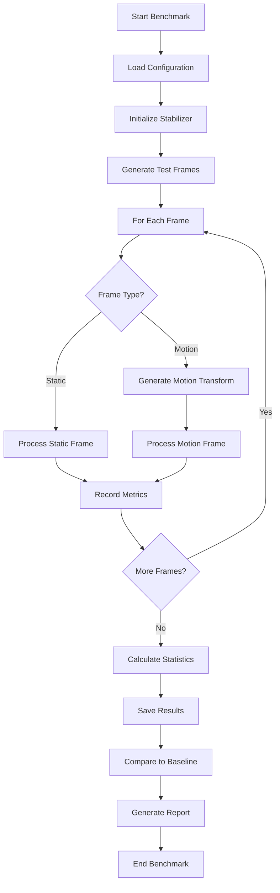

# Performance Testing Infrastructure - Architecture Design

## Overview
This document describes the high-level system design for a comprehensive performance testing infrastructure for the OBS Stabilizer plugin. The system will enable continuous monitoring of performance characteristics, detection of performance regressions, and guidance for optimization efforts.

## Design Goals

### Primary Objectives
1. **Performance Monitoring**: Continuously measure and track key performance metrics
2. **Regression Detection**: Automatically detect performance degradations
3. **Optimization Guidance**: Provide tools for identifying performance bottlenecks
4. **CI/CD Integration**: Integrate performance tests into automated pipeline
5. **Cross-Platform Support**: Run on Windows, macOS, and Linux

### Non-Functional Requirements
- **Minimal Overhead**: Performance tests should have minimal runtime overhead
- **Deterministic Results**: Tests should produce consistent, reproducible results
- **Extensible**: Framework should support new test scenarios easily
- **Automated**: Full automation with minimal manual intervention
- **Actionable**: Results should provide clear, actionable insights

## System Architecture

### High-Level Components

```
┌─────────────────────────────────────────────────────────────────┐
│                  Performance Testing System                     │
├─────────────────────────────────────────────────────────────────┤
│                                                              │
│  ┌─────────────┐  ┌──────────────┐  ┌──────────┐ │
│  │  Benchmark   │  │  Regression   │  │ Profile  │ │
│  │   Runner    │  │   Detector   │  │  Utils   │ │
│  └─────────────┘  └──────────────┘  └──────────┘ │
│         │                  │                 │           │
│         └──────────────────┴─────────────────┘           │
│                        │                                 │
│         ┌──────────────────────────────────┐             │
│         │     Result Analysis            │             │
│         │        Engine                 │             │
│         └──────────────────────────────────┘             │
│                        │                                 │
│  ┌─────────────────────────────────────────────────────┐ │
│  │           Data Storage                       │ │
│  │  (CSV/JSON/Baseline Files)                  │ │
│  └─────────────────────────────────────────────────────┘ │
│                                                         │
└─────────────────────────────────────────────────────────────────┘
```

### Component Descriptions

#### 1. Benchmark Runner (`performance_benchmark.cpp`)
**Purpose**: Orchestrates execution of performance test suite

**Responsibilities**:
- Load and execute performance test scenarios
- Collect timing and memory metrics
- Generate CSV/JSON output files
- Compare results against baselines

**Key Classes**:
```cpp
class BenchmarkRunner {
public:
    struct BenchmarkResult {
        std::string scenario_name;
        int resolution_width;
        int resolution_height;
        int frame_rate;
        
        // Timing metrics
        double avg_processing_time_ms;
        double min_processing_time_ms;
        double max_processing_time_ms;
        double std_deviation_ms;
        
        // Memory metrics
        size_t peak_memory_bytes;
        size_t avg_memory_bytes;
        
        // Status
        bool passed;
        std::string failure_reason;
    };
    
    void run_benchmark_suite();
    void save_results(const std::string& format);
    bool compare_against_baseline();
private:
    std::vector<BenchmarkResult> results_;
    std::map<std::string, BenchmarkResult> baselines_;
};
```

#### 2. Performance Tests (`performance_test.cpp`)
**Purpose**: Individual test scenarios for specific use cases

**Test Categories**:

**A. Processing Time Tests**
```cpp
class ProcessingTimeTest {
    void test_static_scene_processing();
    void test_slow_panning();
    void test_fast_camera_shake();
    void test_zoom_operations();
    void test_complex_background_tracking();
};
```

**B. Memory Tests**
```cpp
class MemoryTest {
    void test_memory_stability();
    void test_memory_leak_detection();
    void test_buffer_utilization();
    void test_peak_memory_usage();
};
```

**C. Parameter Impact Tests**
```cpp
class ParameterImpactTest {
    void test_feature_count_impact();
    void test_smoothing_radius_impact();
    void test_quality_level_impact();
    void test_max_correction_impact();
};
```

**D. Resolution Tests**
```cpp
class ResolutionTest {
    void test_480p_performance();
    void test_720p_performance();
    void test_1080p_performance();
    void test_1440p_performance();
    void test_4k_performance();
};
```

#### 3. Regression Detector (`performance_regression.cpp`)
**Purpose**: Automatically detect performance degradations

**Detection Algorithm**:
```cpp
class RegressionDetector {
    struct Thresholds {
        double processing_time_degradation_percent = 10.0;
        double memory_increase_percent = 20.0;
        double frame_rate_degradation_percent = 5.0;
    };
    
    bool detect_regression(const BenchmarkResult& current,
                        const BenchmarkResult& baseline);
    RegressionReport generate_report();
};
```

#### 4. Profiling Utilities (`profiling_utils.cpp`)
**Purpose**: Identify performance hotspots and bottlenecks

**Key Functions**:
```cpp
class Profiler {
    void start_profiling(const std::string& name);
    void end_profiling();
    ProfileReport generate_report();
    
    struct FunctionProfile {
        std::string function_name;
        size_t call_count;
        double total_time_ms;
        double avg_time_ms;
        double self_time_ms;
    };
};
```

#### 5. Result Analysis Engine (`analyze_performance.py`)
**Purpose**: Process and visualize benchmark results

**Features**:
- Generate HTML performance reports
- Create trend charts over time
- Compare results across configurations
- Highlight performance anomalies

## Test Scenarios

### Scenario Matrix

| Scenario | Type | Resolution | Frames | Duration | Purpose |
|-----------|------|------------|--------|---------|
| Static Scene | Baseline | 1080p | 1000 | 30s | Establish baseline performance |
| Slow Pan | Motion | 1080p | 1000 | 30s | Test tracking stability |
| Fast Shake | Motion | 1080p | 1000 | 30s | Test recovery speed |
| Zoom | Motion | 1080p | 1000 | 30s | Test feature detection |
| Complex Background | Tracking | 1080p | 1000 | 30s | Test feature matching |
| Extended Run | Stability | 1080p | 10000 | 5m | Test memory stability |
| Multi-Resolution | Scale | 480p-4K | 500 each | - | Test resolution scaling |
| Parameter Sweep | Tuning | 1080p | 500 each | - | Test parameter impact |

### Test Execution Flow



## Data Format

### Benchmark Result Format (CSV)
```csv
scenario_name,resolution_width,resolution_height,frame_rate,
avg_processing_time_ms,min_processing_time_ms,max_processing_time_ms,std_deviation_ms,
peak_memory_bytes,avg_memory_bytes,passed,failure_reason

Static Scene,1920,1080,30,10.5,9.8,12.3,0.8,52428800,51118000,true,

Slow Pan,1920,1080,30,11.2,10.5,13.8,0.9,53248000,52000000,true,
```

### Baseline Format (JSON)
```json
{
  "baselines": {
    "Static Scene": {
      "1080p": {
        "avg_processing_time_ms": 10.5,
        "peak_memory_bytes": 52428800,
        "timestamp": "2026-01-22T00:00:00Z"
      }
    }
  },
  "version": "1.0",
  "last_updated": "2026-01-22T00:00:00Z"
}
```

## Integration with CI/CD

### GitHub Actions Integration

```yaml
# .github/workflows/performance.yml
name: Performance Tests

on:
  push:
    paths:
      - 'src/core/**'
      - 'tests/**'
  pull_request:
    paths:
      - 'src/core/**'
      - 'tests/**'

jobs:
  benchmark:
    runs-on: ${{ matrix.os }}
    strategy:
      matrix:
        os: [ubuntu-latest, macos-latest, windows-latest]
    
    steps:
      - uses: actions/checkout@v3
      - name: Setup dependencies
        run: |
          # Install OpenCV and build tools
          ...
      
      - name: Build benchmarks
        run: |
          cmake -B build/perf
          cmake --build build/perf --target performance_benchmark
      
      - name: Run benchmarks
        run: |
          ./build/perf/performance_benchmark --output-format json
      
      - name: Detect regressions
        run: |
          ./build/perf/performance_regression --threshold 10
      
      - name: Upload results
        uses: actions/upload-artifact@v3
        with:
          name: benchmark-results-${{ matrix.os }}
          path: results/
```

### Regression Detection Thresholds

| Metric | Baseline | Degradation Threshold | Action |
|--------|----------|----------------------|--------|
| Processing Time | Current | +10% | Fail CI, create issue |
| Memory Usage | Current | +20% | Warning, review |
| Frame Rate | Target 30fps | -5% | Fail CI, create issue |
| Std Deviation | Current | +50% | Warning, investigate |

## File Organization

```
src/
  performance_benchmark.cpp          # Main benchmark runner
  performance_test.cpp             # Test scenario implementations
  performance_regression.cpp        # Regression detection
  profiling_utils.cpp            # Profiling utilities
  benchmark_scenarios.hpp         # Test scenario definitions
  performance_metrics.hpp         # Metric structures

tests/
  test_performance_benchmark.cpp   # Unit tests for benchmark framework

scripts/
  run-perf-benchmark.sh         # Run full benchmark suite
  run-perf-regression.sh        # CI/CD regression testing
  analyze-perf-results.py        # Python analysis script

docs/
  performance-testing-architecture.md  # This file
  performance-testing-guide.md       # User guide for running tests

results/
  baselines/                     # Baseline files (versioned)
  historical/                    # Historical benchmark data
  reports/                      # Generated HTML/CSV reports
```

## Phase Implementation Plan

### Phase 1: Basic Performance Tests (Week 1-2)

**Week 1: Core Infrastructure**
- [ ] Design and implement BenchmarkRunner class
- [ ] Create benchmark scenarios data structures
- [ ] Implement basic timing utilities
- [ ] Create CSV/JSON output formatters
- [ ] Unit tests for benchmark framework

**Week 2: Test Implementation**
- [ ] Implement static scene processing test
- [ ] Implement slow pan motion test
- [ ] Implement fast camera shake test
- [ ] Implement memory stability test
- [ ] Implement resolution scaling tests
- [ ] Integration testing

### Phase 2: Performance Regression Testing (Week 2-3)

**Week 2: Regression Detection**
- [ ] Implement baseline loading/saving
- [ ] Create regression detection algorithm
- [ ] Define degradation thresholds
- [ ] Implement comparison logic
- [ ] Unit tests for regression detector

**Week 3: CI/CD Integration**
- [ ] Create GitHub Actions workflow
- [ ] Integrate with existing CI/CD
- [ ] Setup result artifact storage
- [ ] Configure notification on regression
- [ ] End-to-end testing

### Phase 3: Optimization Guidance (Week 3-4)

**Week 3: Profiling Tools**
- [ ] Implement profiling utilities
- [ ] Create function call tracking
- [ ] Implement hotspot detection
- [ ] Generate profiling reports
- [ ] Unit tests for profiler

**Week 4: Analysis & Reporting**
- [ ] Create Python analysis script
- [ ] Implement HTML report generation
- [ ] Create trend visualization
- [ ] Compare results across platforms
- [ ] Documentation

## Success Criteria

### Phase 1 Success
- [ ] Benchmark executable runs successfully on all platforms
- [ ] All test scenarios execute without errors
- [ ] Results saved in CSV and JSON formats
- [ ] Baseline comparisons functional
- [ ] Unit tests pass (100%)

### Phase 2 Success
- [ ] Regression detection operational
- [ ] CI/CD pipeline passes with performance checks
- [ ] Degradations detected within thresholds
- [ ] Notifications sent for regressions
- [ ] Baselines versioned and trackable

### Phase 3 Success
- [ ] Profiling tools identify actual hotspots
- [ ] Analysis reports generated automatically
- [ ] Performance trends visualized over time
- [ ] Cross-platform comparisons available
- [ ] Documentation complete

## Risks and Mitigations

### Risk 1: Performance Test Overhead
**Impact**: Performance tests may consume significant time in CI/CD

**Mitigation**:
- Run full benchmarks on nightly schedule, not every PR
- Use sampling for PR validation (subset of tests)
- Cache baseline files to avoid redundant calculations

### Risk 2: Non-Deterministic Results
**Impact**: Inconsistent results make regression detection unreliable

**Mitigation**:
- Use fixed random seeds in test data generation
- Isolate from system load (dedicated CI runners)
- Run multiple iterations, use median values
- Set minimum CPU governor to fixed frequency

### Risk 3: False Positives
**Impact**: Normal variance flagged as regression

**Mitigation**:
- Use statistically significant thresholds (e.g., 10% not 5%)
- Require multiple data points before flagging
- Allow manual review before auto-failing builds
- Track trends over time, not single points

## Future Enhancements

### Potential Future Features
- **GPU Profiling**: Track GPU usage if acceleration added
- **Real-time Monitoring**: Live performance dashboard
- **ML-Based Prediction**: Predict performance impact of code changes
- **Automated Optimization Suggestions**: AI recommendations for improvements
- **Crowd-Sourced Baselines**: Community-contributed baselines

## References

- **Existing Code**: `src/core/stabilizer_core.cpp`, `src/core/adaptive_stabilizer.cpp`
- **Test Infrastructure**: `tests/` directory with Google Test
- **CI/CD**: `.github/workflows/` for existing automation
- **Performance Data**: `README.md` performance characteristics section
